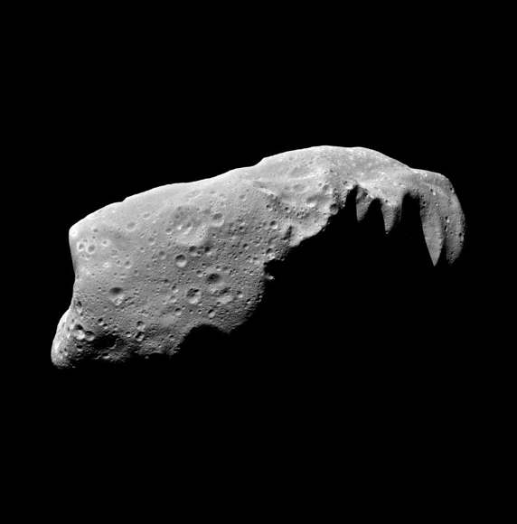
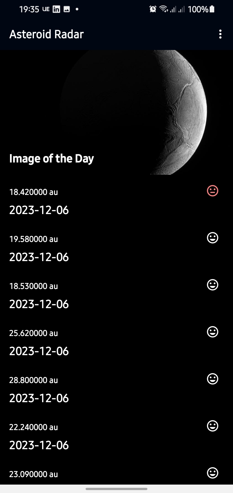
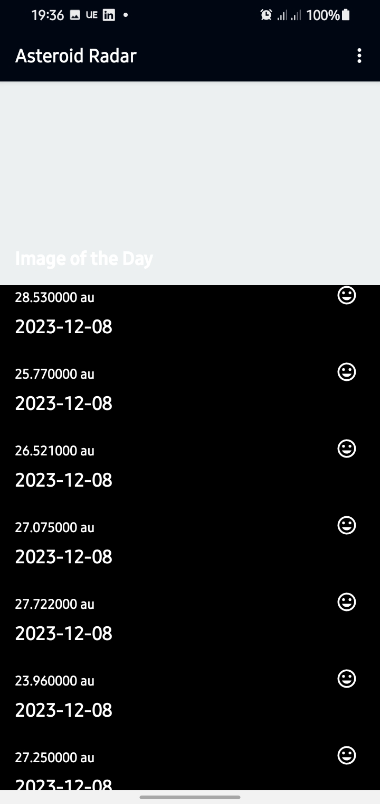
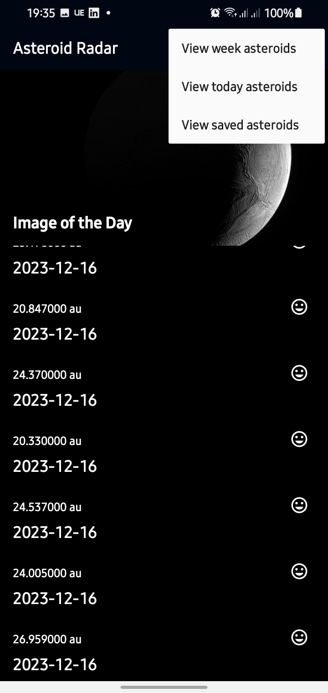
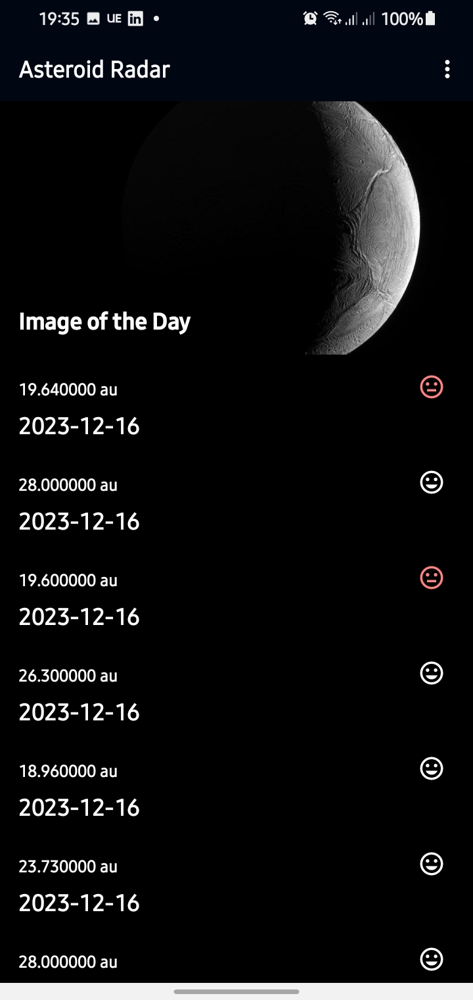
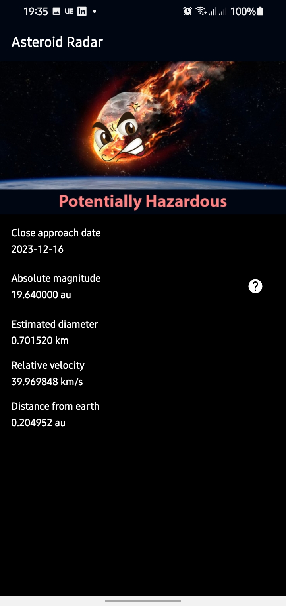
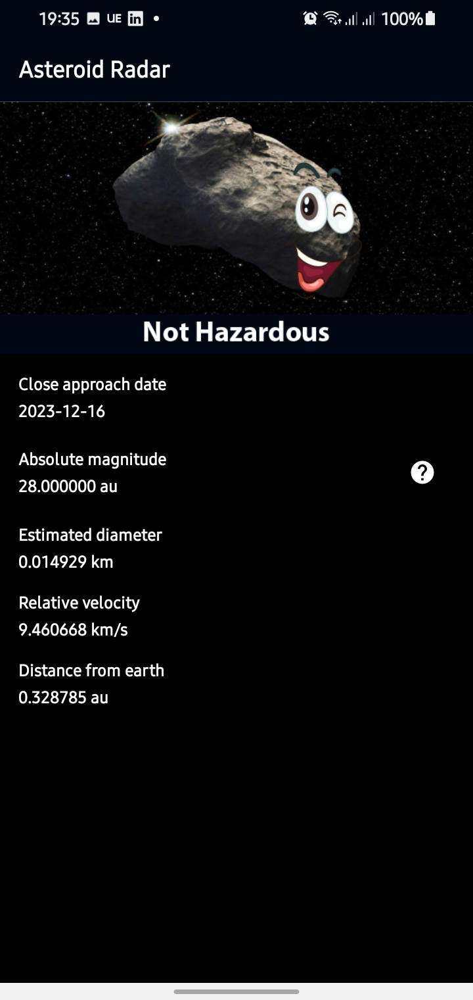

# Asteroid Radar



Asteroid Radar is an Android application designed to provide users with a captivating interface for exploring asteroids detected by NASA as they approach Earth. With this app, users can access detailed information about asteroids, including their size, velocity, distance to Earth, and potential hazard status. The project showcases the implementation of various skills such as fetching data from the internet, saving data to a database, and presenting the information in an intuitive user interface.

## Project Overview

### Key Features

- View a list of all detected asteroids within a specified period.
- Retrieve asteroid details, including size, velocity, distance to Earth, and hazard status.
- Utilize the NEoWs API, a free and open-source service provided by NASA JPL Asteroid team.

### Screens

1. **Main Screen:**
   - Display a list of all detected asteroids.
   - Include the NASA Image of the Day to enhance the visual appeal of the app.

2. **Details Screen:**
   - Show detailed information about a selected asteroid from the Main Screen list.

## Getting Started

### Prerequisites

- Android Studio
- NEoWs API Key (Get it [here](https://api.nasa.gov/))

### Setup

1. Clone the repository:
   ```bash
   git clone https://github.com/simbastart001/Asteroid-Radar-App.git
Open the project in Android Studio.

In the gradle/wrapper/gradle-wrapper.properties file, update the Gradle version:
Build and run the app on your Android device or emulator.

### Technologies Used

Jetpack Components (ViewModel, Room, LiveData, Data Binding, Navigation)
WorkManager for automated background tasks
Moshi for data processing and serialization
Picasso for reliable image management

### License
This project is licensed under the MIT License.
Feel free to customize the content according to your specific project details.

### Screenshots







